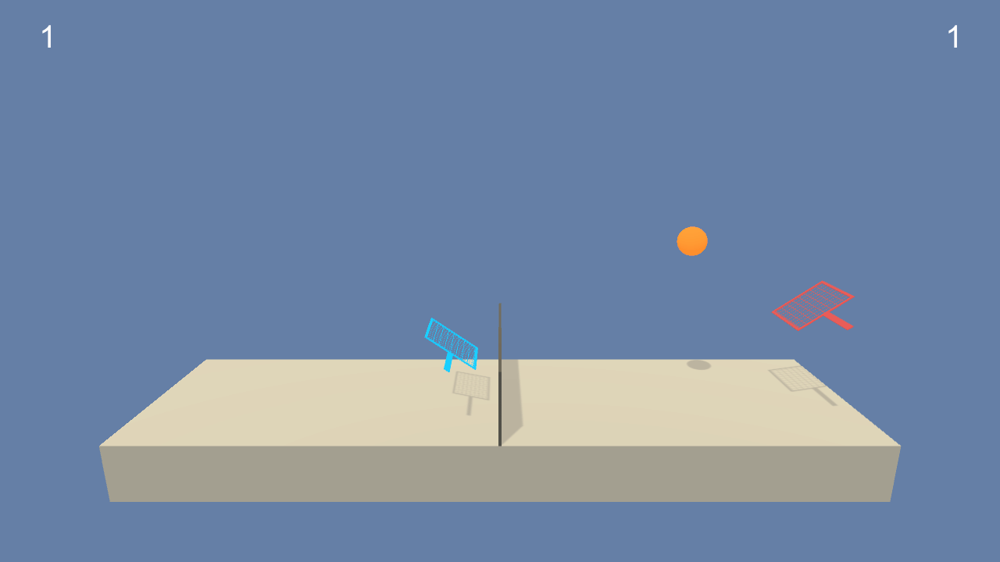

# Tennis-without-Humanity

Deep reinforcement learning used to solve a cooperative [Tennis](https://github.com/Unity-Technologies/ml-agents/blob/master/docs/Learning-Environment-Examples.md#tennis) environment.



## Environment Overview

The tennis environment consists of 2 paddles (or agents) to train with the goal of keeping a ball in the air for as many volleys as possible. Each paddle obtains observations of the environment relative to its current location each time step, and must select actions determining how to move, once again relative to its own position. An agent is rewarded when it successfully hits the ball over the net, and is punished if it let's the ball drop on its side of the net or hits the ball out of bounds.

### State Space

The state space for each agent contains 8 variables for the position and velocity of the ball and paddle. All of the values are continuous.

### Action Space

Each agent sends actions to the environment with just two continuous values, one for movement towards (or away from) the net, and one for jumping.

### Rewards and Scoring

The rewards for this environment motivate the agents to act cooperatively by rewarding each agent for successful volleys using the following rewards:

* ```+ 0.1``` if the agent hits the ball over the net
* ```-0.01``` if the agent lets the ball hit the ground
* ```-0.01``` if the agent hits the ball out of bounds

Scoring for this multi agent episodic task is done by taking the max score of all agent each episode to produce an episode score, and then taking the average of that episode score over 100 consecutive episodes.

For this project to be considered solved, the agent must achieve an average episode score over 100 consecutive episodes of ```0.5```.

## Getting Started

Setup the project with the ```git clone``` -> ```conda create [virtualenv]``` -> ```pip install [dependencies]``` workflow, outlined below in detail.

Additionally you'll need to download the Unity Environment solved in this project, links provided below.

### Installation

1. clone the repository:

    ``` bash
    git clone https://github.com/TacticSiege/Tennis-without-Humanity
    cd Tennis-without-Humanity
    ```

2. Create a virtualenv with Anaconda and activate it:

    * Linux or Mac:

    ``` bash
    conda create --name drlnd python=3.6
    source activate drlnd
    ```

    * Windows:

    ``` bash
    conda create --name drlnd python=3.6
    activate drlnd
    ```

3. Install project dependencies:

    ``` bash
    cd python/
    pip install .
    cd ..
    ```

4. Download the Unity Environment for your OS:

    | Operating System | Link |
    |------------------|------|
    | Windows (32bit) | [click here](https://s3-us-west-1.amazonaws.com/udacity-drlnd/P3/Tennis/Tennis_Windows_x86.zip) |
    | Windows (64bit) | [click here](https://s3-us-west-1.amazonaws.com/udacity-drlnd/P3/Tennis/Tennis_Windows_x86_64.zip) |
    | MacOS | [click here](https://s3-us-west-1.amazonaws.com/udacity-drlnd/P3/Tennis/Tennis.app.zip) |
    | Linux | [click here](https://s3-us-west-1.amazonaws.com/udacity-drlnd/P3/Tennis/Tennis_Linux.zip) |

    Extract the archive into the project directory, or you may update the ```env_path``` in the notebook(s) to use a custom directory.

5. (Optional) Associate a Jupyter Notebook kernel with our virtualenv:

    ``` bash
    python -m ipykernel install --user --name drlnd --display-name "drlnd"
    ```

    If you forget to activate your virtualenv, you can choose the kernel created above from the Jupyter Notebook UI.

6. Run Jupyter Notebook and explore the repo:

    ``` bash
    jupyter notebook
    ```

### Running the Agent

* Train the agent using ```TrainAgent.ipynb```

* Watch a trained agent by loading saved model weights in the last few cells of the notebook.  This repo contains saved model weights for the solution agent, ```Agent OmegaPong```, that are already setup to run.

See ```Report.md``` for more details on implementation and training results.
