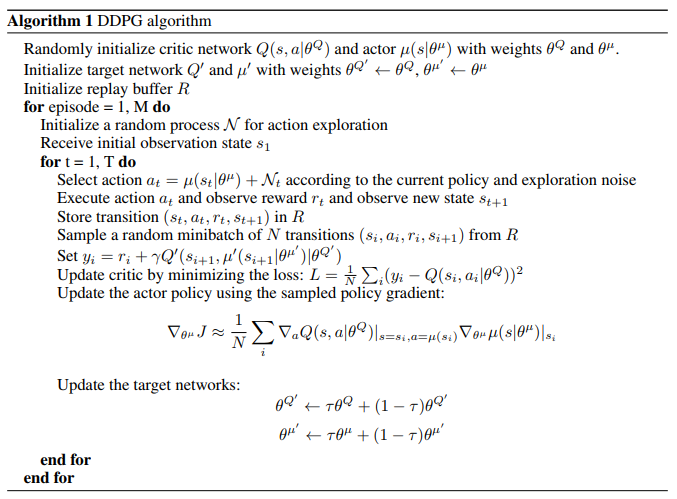
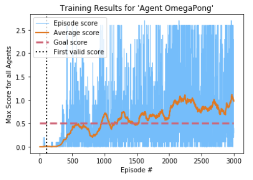

# Tennis-without-Humanity Report: Agent OmegaPong

To solve this environment a Deep Deterministic Policy Gradient (DDPG) model was used for the agent. Briefly, the DDPG agent architecture consists of four neural networks to learn from experience, and a replay buffer to store experiences that are sampled from during learning. A single model was used to train and control both agents (paddles) in the environment. The symmetric nature of the tennis task and the fact that each agents' observations are relative to the paddles themselves means both observations and actions are equivalent for both paddles.

## Files

The following files are used for this implementation:

| Filename | Purpose |
| --- | --- |
| ```ddpg_model.py``` | Contains the Actor and Critic neural net models |
| ```ddpg_agent.py``` | Agent architecture containing all used neural networks |
| ```experience_buffers.py``` | Experience replay buffer(s) used by agents |
| ```ou_noise.py``` | Ornstein-Uhlenbeck noise, used for action-space exploration |
| ```trainer_ddpg.py``` | Training function for DDPG agents |
| ```demos.py``` | Demos using trained or saved agents |
| ```agent_utils.py``` | Utility functions including saving models and plotting |

## DDPG


*[source](https://arxiv.org/abs/1509.02971)*

### Experience Replay Buffer

Experiences of ```(state, action, reward, next_state, done)``` tuples are observed by each paddle every time step and stored in the same shared Experience Replay Buffer. The replay buffer uses the ```buffer_size``` hyperparameter to determine how many experiences it should keep before discarding or 'forgetting' the oldest. During learning, ```batch_size``` samples are selected uniformly at random and used for the update, using experiences from the multiple different arms.

Support for index based sampling has been added but left unused for this implementation.  Index based sampling can be used when multiple agents have their own individual replay buffers to produce the experiences for the same time steps across many agents.

### Weight Copying with Soft Update

When copying the weights of the local network to the target network every learning pass, a soft update method was used, intoducing a new hyperparameter ```tau``` that controls the interpolation of target and local network weights used to update the target network. This method of partial copying helps to stabilize training.

### Ornstein-Uhlenbeck Noise

Ornstein-Uhlenbeck noise was added to the values returned by the actor network to provide an element of exploration to the actions selected by the agent.

## Network Architecture

Both the actor and critic network models contain both a local and target copy of the model, where the target weights are copied from the local network using the soft update described above.

The actor network uses a linear input layer the same size as the state space, followed immediately by an optional batch normalization layer before passing through a ReLU activation. A configurable number of fully connected linear hidden layers each with a ReLU activation follow. Output from the network comes after a final fully connected layer matching the size of the action space and ending with a tanh activation.

The critic network starts with the same linear input layer the same size as the state space, with an optional batch normalization layer and a ReLU activation. The output from this activation is then combined with action input the size of the action space. This combined tensor becomes the input to a configurable number of fully connected linear hidden layers with ReLU activations. This goes through a final fully connected output layer of size 1, returning the output without any activation representing the Q value of the (state, action) critic input.

## Hyperparameters

The following table lists the hyperparameters available for this agent and training algorithm.

| Hyperparameter | Default | Description |
| ---- | --- | --- |
| name | 'default_ddpg' | Name of agent, not impact on training. Used for save directory. |
| layers_actor | [128, 128] | List of layer sizes used for the actor local and target networks. |
| layers_critic | [128, 128] | List of layer sizes used for the critic local and target networks, not including the extra action tensor |
| batch_norm | False | If a batch normalization layer should be added. |
| buffer_size | 1000000 | Length of Experience Replay Buffer. |
| batch_size | 128 | Batch size for sampling the Experience Replay Buffer. |
| lr_actor | 0.0001 | Learning rate of the actor local network. |
| lr_critic | 0.0003 | Learning rate of the critic local network. |
| gamma | 0.99 | Discount factor for future rewards. |
| tau | 0.001 | Interpolation factor for soft update. Full target copy = 0 |
| weight_decay | 0.0001 | Decay factor for critic optimizer weights |
| learn_every | 100 | Number of time steps between learning updates |
| learn_passes | 1 | Number of passes every learning update |

## Results

The agent trained to solve this environment, ```Agent OmegaPong```, used the following network:

### Actor Network

* input layer of size ```8``` with batch normalization and ReLU activation
* hidden layer of size ```512``` with ReLU activation
* hidden layer of size ```256``` with ReLU activation
* output layer of size ```2``` with tanh activation

### Critic Network

* input layer of size ```8``` with batch normalization and ReLU activation
* hidden layer of size ```512``` + ```2``` (action space) with ReLU activation
* hidden layer of size ```256``` with ReLU activation
* output layer of size ```1``` without any activation (Q-value for action-state pair)

The parameters used by ```Agent OmegaPong``` took a fair amount of tuning before successfully solving the environment. While a few similar sets of hyperparameters were able to reach the goal score, ```Agent OmegaPong``` was the best performer and the only tested model which remained mostly above the goal score after first reaching it. The final chosen parameters are listed below. The most notable changes are an extra layer in the critic network and the overall larger number of nodes per layer.

| Hyperparameter | Value |
| --- | --- |
| name | 'Agent OmegaPong' |
| layers_actor | [512, 256] |
| layers_critic | [512, 256, 256] |
| batch_norm | True |
| buffer_size | 1000000 |
| batch_size | 256 |
| lr_actor | 0.0005 |
| lr_critic | 0.001 |
| gamma | 0.99 |
| tau | 0.005 |
| weight_decay | 0.0 |
| learn_every | 5 |
| learn_passes | 5 |

```Agent OmegaPong``` was able to score ```0.5``` (averaged over 100 consecutive episodes) to solve the environment in ```951``` episodes. Training on a consumer-grade GPU took just over 70 minutes. Continuing training for a total of ```3000``` episodes completed in just under 10 hours and showed sustained passing performance. During the extended training this model reached a high score of ```1.12``` (averaged over 100 consecutive episodes).



*Plot of agent training, with the full range of score and a smoothed average score over 100 episodes.*

## Ideas for Future Work

The DDPG agent used to solve this environment trained in a reasonable amount of time and once tuned remained (mostly) above the goal score during extended training.

A key disadvantage of this implementation comes from the assumption that lets a single agent work for both paddles. By taking advantage of the environments symmetries and the relativeness of observations made by each agent, this implementation does not take the full environment state into account, I.E. the observations and actions from both agents at a single time step are never considered together.

* The overall stability leaves room for improvement, and could be addressed by adjusting learning and copy rates for the agent networks once a certainly level of performance was achieved.
* Prioritized Experience Replay improves sample efficiency by weighting experiences based on their impact on training. This can lead to improved training time, and is used in several agent architectures.
* Multi-Agent Deep Deterministic Policy Gradient (MADDPG) is an adaptation of DDPG suited for multiple agents. MADDPG uses observations and actions from all agents for the critic network during training, while still only using an agent's local observations for the actor network.

## References

* P., Timothy, et al. “Continuous Control with Deep Reinforcement Learning.” ArXiv.org, 5 July 2019, arxiv.org/abs/1509.02971.
* “Deterministic Policy Gradient Algorithms.” Deepmind, deepmind.com/research/publications/deterministic-policy-gradient-algorithms.
* R., Lowe, et al. "Multi-Agent Actor-Critic for Mixed Cooperative-Competitive Environments." ArXiv.org, 16 June 2018, arxiv.org/abs/1706.02275.
* Udacity Deep Reinforcement Learning Nanodegree Program, https://www.udacity.com/course/deep-reinforcement-learning-nanodegree--nd893.

## Additional Material

### Saved Agent Structure

Agents are saved during training to the ```saved_agents/[agent_name]/``` directory, where ```[agent_name]``` is the agent name. The created agent directory contains the files outlined below, saving properties of the agent and results of training.

| Filename(s) | Description |
| --- | ---- |
| actor_weights.pyt | Final weights for the actor network |
| critic_weights.pyt | Final weights for the critic network |
| params.json | Hyperparameters used for this agent, saved as a json dictionary |
| scores.npy | Scores the agent earned during training, in the numpy .npy format |
| /.checkpoints/[ep_#]-actor_weights.pyt | Checkpoints for actor network weights |
| /.checkpoints/[ep_#]-critic_weights.pyt | Checkpoints for critic network weights |
| /.checkpoints/[ep_#]-scores.npy | Checkpoints for training scores |
